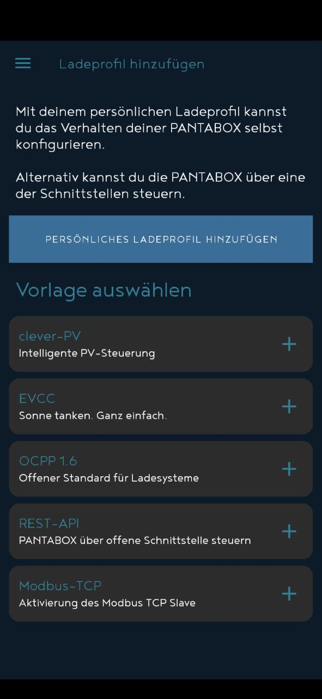

# INRO PANTABOX

Connects nymea to INRO PANTABOX wallboxes.

## Requirements

In order to connect your PANTABOX to the nymea system, the charger must be in the same network as the nymea system. The nymea server uses the Modbus TCP connection to connect to the wallbox.

Modbus TCP is available since firmware version `V1.13.6` of the PANTABOX. Please make sure your PANTABOX is up to date before setting up the charger in nymea.

Once the network connection has been established, use the original [PANTABOX app](https://www.pantabox.de/Informationen/App/) in order to enable the `Modbus TCP` profile.

Once the `Modbus TCP` profile has been enabled, the PANTABOX can be discovered in the network. The default port is `502` and the default slave ID is `1`.

## Settings

In the thing settings can be defined, which phases are connected to the wallbox. This information is important for the energy management in order to be able to have an overload protection.

## More

https://www.pantabox.de/
